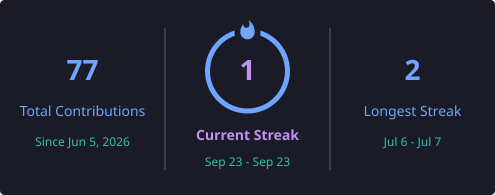

<div align="center">


# 👋 Hi, I'm **Nur Jahan**

<p align="center">
  
</p>

<p align="center">
  
  
  
</p>

<p align="center">
  <a href="https://www.linkedin.com/in/nur-jahan-47762b318/">
    
  </a>
  <a href="mailto:nurj1h1n@gmail.com">
    
  </a>
  <a href="https://nurtured-updates-973268.framer.app/">
    
  </a>
</p>

</div>

---

## 👩‍💻 About Me

I'm a **Computer Science & Engineering student** passionate about building practical software and turning ideas into real-world applications.

* 🎓 Currently studying **CSE at United International University**
* 💻 Interested in **Web Development & Software Engineering**
* 🚀 Building practical and real-world projects
* 🧠 Improving my **Data Structures & Algorithms** skills
* 🌐 Exploring modern frontend and backend technologies
* 🤖 Learning about **AI/ML and intelligent applications**
* 🔧 Interested in backend development, APIs, databases, and system design
* 📚 Always learning, experimenting, and improving

---

## 🚀 Currently Exploring

```text
Next.js
Backend Development
REST APIs
Database Design
System Design
Data Structures & Algorithms
AI / Machine Learning
DevOps & Docker
Open Source
Real-World Software Projects
```

---

# 🛠️ Tech Stack

## 💻 Programming Languages

<p align="left">
  
</p>

## 🎨 Frontend Development

<p align="left">
  
</p>

## ⚙️ Backend & Database

<p align="left">
  
</p>

## 🔧 Tools & Technologies

<p align="left">
  
</p>

---

# 🌟 Featured Projects

<table>
<tr>

<td width="50%" valign="top">

<h3 align="center">🏗️ BuildCore</h3>

<p align="center">
  
</p>

<p>
<strong>BuildCore</strong> is a construction and company management system designed to manage projects, employees, clients, finances, inventory, suppliers, payments, attendance, and other business operations.
</p>

### ✨ Features

* 🔐 Role-based authentication
* 👨‍💼 Admin / Leader / Client dashboards
* 🏗️ Project management
* 👥 Employee management
* 📦 Inventory management
* 🧱 Material usage tracking
* 💰 Finance & payments
* 🧾 Invoice management
* 🚚 Supplier management
* 💵 Salary & payment management
* 🕒 Employee attendance
* 🌴 Leave management
* 📸 Project/site updates
* 🍱 Lunch arrangements
* 💼 Job postings & applications

### 🧰 Tech Stack

`PHP` `MySQL` `JavaScript` `HTML` `CSS` `Bootstrap`

<p align="center">
  <a href="https://github.com/nurjahan2420628-ctrl/buildcore">
    
  </a>
</p>

</td>

<td width="50%" valign="top">

<h3 align="center">🌏 Visit Bangladesh</h3>

<p align="center">
  
</p>

<p>
<strong>Visit Bangladesh</strong> is a tourism website designed to showcase Bangladesh's beautiful destinations, culture, history, food, and travel experiences.
</p>

### ✨ Features

* 🗺️ Tourist destination exploration
* 🏛️ Historical places
* 🍛 Bangladeshi food
* 🌄 Destination showcase
* 📱 Responsive design
* 🎨 Modern user interface
* 🧭 Easy navigation
* 🇧🇩 Tourism-focused content

### 🧰 Tech Stack

`HTML` `CSS` `JavaScript`

<p align="center">
  <a href="https://github.com/nurjahan2420628-ctrl/visit-bangladesh">
    
  </a>
</p>

</td>

</tr>
</table>

---

# 📊 GitHub Statistics

<p align="center">
  
  
</p>

<p align="center">
  
</p>

---

# 🐍 Contribution Snake

<p align="center">
  <picture>
    <source
      media="(prefers-color-scheme: dark)"
      srcset="https://raw.githubusercontent.com/nurjahan2420628-ctrl/nurjahan2420628-ctrl/output/github-contribution-grid-snake-dark.svg"
    />
    <source
      media="(prefers-color-scheme: light)"
      srcset="https://raw.githubusercontent.com/nurjahan2420628-ctrl/nurjahan2420628-ctrl/output/github-contribution-grid-snake.svg"
    />
    
  </picture>
</p>

---

# 🎯 My 2026 Goals

* [ ] 🚀 Become a stronger full-stack developer
* [ ] 🧠 Improve Data Structures & Algorithms
* [ ] 🤖 Build practical AI/ML projects
* [ ] 🔬 Start working on research and publications
* [ ] 🏗️ Build more production-level projects
* [ ] ☁️ Learn cloud technologies
* [ ] 🐳 Improve Docker & DevOps skills
* [ ] 🌐 Contribute to open source
* [ ] 💼 Prepare for software engineering internships/jobs
* [ ] 📚 Keep learning new technologies

---

# 🤝 Connect With Me

<p align="center">

<a href="https://www.linkedin.com/in/nur-jahan-47762b318/">
  
</a>

<a href="mailto:nurj1h1n@gmail.com">
  
</a>

<a href="https://nurtured-updates-973268.framer.app/">
  
</a>

<a href="https://github.com/nurjahan2420628-ctrl">
  
</a>

</p>

---

<div align="center">

### 💜 *"Turning ideas into real things, one line of code at a time."*

⭐ **Thanks for visiting my profile!**

</div>
